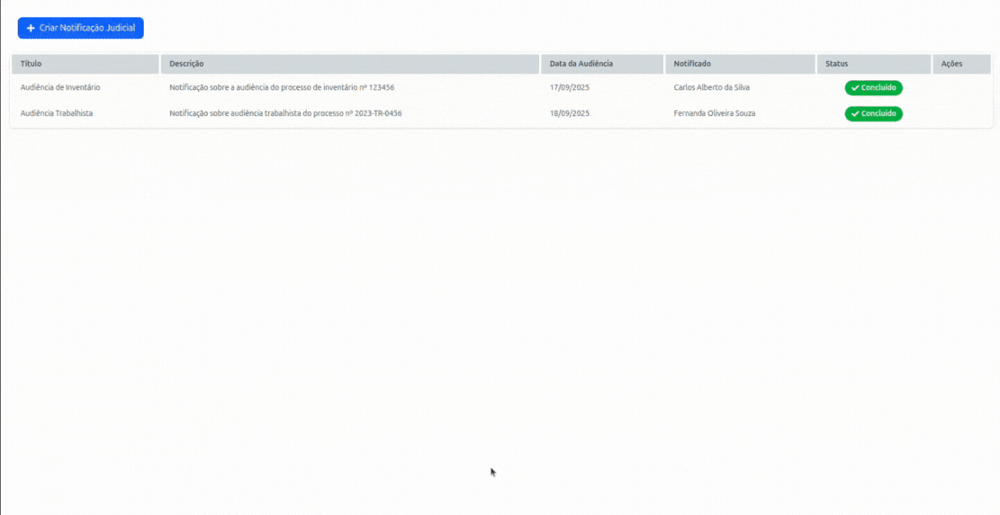

<h1 align="center">Notification App ✅</h1>
<h3 align="center">📸Screenshot</h3>
<p>
<h1 align="center"></h1>

## `📋 Sobre`
Este projeto consiste na implementação de um sistema simples de Notificação Judicial, seguindo um fluxo de três etapas principais:

Criação da notificação judicial – Registra uma nova notificação no banco de dados com status inicial “**Em Andamento**”, contendo título, descrição e data da audiência.

Preenchimento das informações do(a) notificado(a) – Permite complementar os dados da pessoa notificada (nome, e-mail, telefone e endereço). Ao finalizar, o status é alterado para “**Validação**”.

Validação da notificação judicial – Exibe todas as informações cadastradas sem possibilidade de edição. Nesta etapa é possível indicar se são necessárias informações adicionais.

Caso **sim**, o sistema retorna para a etapa anterior e altera o status para “**Em Andamento**”.

Caso **não**, o fluxo é concluído e o status final da notificação passa a ser “**Concluído**”.

## `🚀 Tecnologias utilizadas`
- [**Node.js (v22)**](https://nodejs.org/pt) → Ambiente de execução JavaScript no lado do servidor

- [**Express**](https://expressjs.com/) → Framework minimalista que facilita a criação de rotas e middlewares. A escolha foi feita pela sua simplicidade e flexibilidade, permitindo construir uma API de forma clara e rápida.

- [**TypeScript**](https://www.typescriptlang.org/) → Adotado para garantir tipagem estática, reduzindo erros em tempo de execução e melhorando a manutenção do código.

- [**MongoDB**](https://www.mongodb.com/) → Banco de dados NoSQL orientado a documentos que proporciona flexibilidade de modelagem e escalabilidade para a aplicação.

- [**Docker**](https://www.docker.com/) → Containerização para padronizar ambientes de desenvolvimento e produção

- [**React.js**](https://react.dev/) → Biblioteca JavaScript para construção de interfaces de usuário

- [**Tailwind CSS**](https://tailwindcss.com/) → Framework CSS utilitário que acelera o desenvolvimento de interfaces responsivas e mantém o estilo consistente em toda a aplicação. 

## `📂 Estrutura do projeto`
```
├── backend
│   ├── docker-compose.yml
│   ├── Dockerfile.dev
│   ├── package.json
│   ├── package-lock.json
│   ├── src
│   │   ├── config
│   │   ├── controllers
│   │   ├── models
│   │   ├── routes
│   │   ├── server.ts
│   │   └── services
│   └── tsconfig.json
├── frontend
│   ├── eslint.config.js
│   ├── index.html
│   ├── package.json
│   ├── package-lock.json
│   ├── public
│   │   └── vite.svg
│   ├── src
│   │   ├── api
│   │   ├── App.tsx
│   │   ├── assets
│   │   ├── components
│   │   ├── index.css
│   │   ├── main.tsx
│   │   ├── pages
│   │   ├── routes.tsx
│   │   ├── types
│   │   └── vite-env.d.ts
│   ├── tsconfig.app.json
│   ├── tsconfig.json
│   ├── tsconfig.node.json
│   └── vite.config.ts
└── README.md

```

## `🚀 Como rodar o backend com Docker`

### Pré-requisitos
- [Docker](https://docs.docker.com/get-docker/) instalado  
- [Docker Compose](https://docs.docker.com/compose/install/) instalado  

### Passo a passo

1. Clone este repositório:
   ```bash
   git clone https://github.com/AAndersonSantos/notification-app.git
   cd backend
   ```

2. Crie um arquivo .env na raiz do projeto com as variáveis necessárias:
   ```bash
   MONGO_URL=mongodb://mongodb:27017/notifications
   ```

3. Instale as dependências localmente (para VSCode funcionar):
   ```bash
   npm install
   ```
4. Suba os containers:
   ```bash
   docker compose up -d --build
   ```
5. Acesse a API em:
   ```bash
   http://localhost:3000
   ```
⚡ Agora o backend estará rodando em um container Node.js, conectado ao MongoDB também containerizado.

## `💻 Instruções para iniciar o frontend`
O frontend da aplicação está fora do Docker e precisa ser iniciado localmente. Siga os passos abaixo:

1. Acesse a pasta do frontend:
   ```bash
   cd frontend
   ```
2. Instale as dependências do projeto:
   ```bash
   npm install
   ```
3. Inicie o servidor de desenvolvimento:
   ```bash
   npm run dev
   ```
4. Acesse a aplicação no navegador:
   ```bash
   http://localhost:5173
   ```